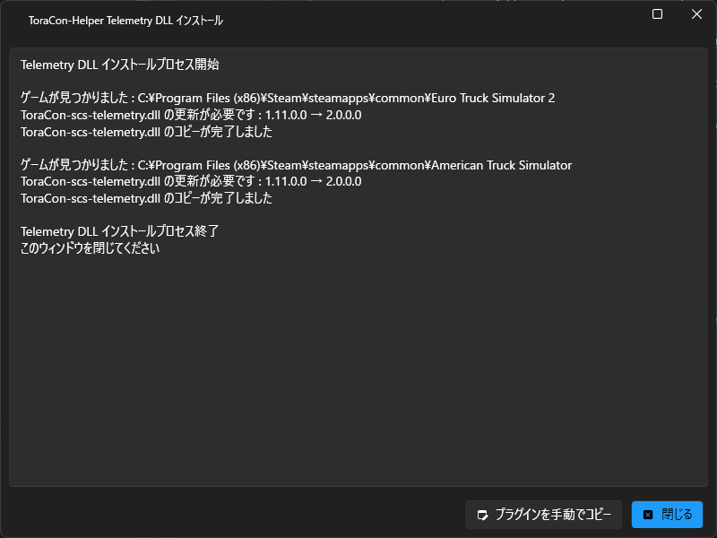

# ToraCon-Helper   

## なにこれ？
[HORI Force Feedback Truck Control System for Windows® PC（通称「トラコン」）](https://hori.jp/products/hpc/hpc-044/) を ETS2/ATS でちょっと便利にするためのヘルパーアプリです。

トラコン専用ってわけではないので、ほかのコントローラーやキーマウでも利用できます。

## 何するアプリ？
ETS2/ATS の [Telemetry SDK](https://modding.scssoft.com/wiki/Documentation/Engine/SDK/Telemetry) の仕組みを利用して、プラグインをインストールする以外の設定変更無しで、ちょっと便利な操作を自動化します。

今までの便利操作系ツールは Key2Key などを利用して実現はできましたが、ETS/ATS のキーコンフィグを変更する必要がありました。そしてプログラミングがわからないとちょっとハードルが高い。。

このアプリは、[Telemetry SDK](https://modding.scssoft.com/wiki/Documentation/Engine/SDK/Telemetry) の出力（外部アプリからテレメトリー情報を読み取る）と入力（外部アプリからコントローラーと同様に入力を送信）機能を両方を使って、ETS2/ATS のキーコンフィグ設定を一切変更せず、ちょっと便利な操作の自動化を実現しています。

## できること（アプリの設定で有効・無効の切り替え可能）
* ウィンカーが出ているときに逆側のウィンカーを出すと、消えるアクション
  * 特にトラコンのウィンカーレバーはスイッチ式のため、ウィンカーを「消す」操作が通常の車の操作と異なります。
  * このアクションで、例えば右ウィンカーが出ているときに左ウィンカー入力をすると、ウィンカーを「消します」
  * ただし、逆側のウィンカーが一瞬表示されてしまいます。これは残念ながら制限事項です。
    * テレメトリーから情報を取っているので、どうしてもウィンカーが表示されてからになってしまいます。
    * この制限事項が微妙・・・という方でトラコンをお持ちの方は、下記の DirectInput 版をご利用下さい。

* (トラコン専用) DirectInput を使ってウィンカーが出ているときに逆側のウィンカーを出すと、消えるアクション
  * 制限事項を撤廃するために DirectInput API を使って、トラコンのウィンカー入力を行います。
  * DirectInput は対象のコントローラーを探す必要があるのですが、トラコン本体（ハンドルの方）を一本釣りでひっかけていますので、トラコン専用です。
  * 利用するための条件は２つ
    * [HORI Force Feedback Truck Control System for Windows® PC（通称「トラコン」）](https://hori.jp/products/hpc/hpc-044/) を利用していること
    * ETS2/ATS のキー設定から、左右のウィンカーの割り当てを「解除」すること
  * ウィンカーレバーは、`左レバー(Button40,41)` または `右レバー(Button46,47)` を選択できます。
  * 上記の DirectInput を利用しないアクションとは併用できませんので、どちらかを有効にしてお使いください。

* ウィンカー オートキャンセルのハンドル回転角度変更
  * ウィンカー オートキャンセル機能は ETS2/ATS に搭載されていますが、ハンドルをほぼ中央まで戻さないと動作しません。
  * ウィンカー オートキャンセルが動作するハンドル回転角度を指定できるようにしました。

* 高速道路 車線変更用ショート ウィンカー
  * 高速道路等で、車線変更用にウィンカーを出したら数秒で自動的に消える機能です。
  * 一部の実車では、レバーを軽く押す、という操作なのですが、実現できないため、下記３つの条件指定で動作します。
    * 有効になる最低速度
    * 無効になるハンドル回転角度
    * ウィンカーが消えるまでの時間
  * まずは初期値でお試しいただき、必要に応じて各条件を変更ください。

* 指定速度以下の場合にリターダーを全段戻す
  * 信号で止まった後、出発するときに「リターダーが！！」って怒られません？
  * 指定された速度以下になったときにリターダーを戻す入力をすると、全段戻ります。

* リターダー1段入れたら全段入れる
  * リターダーが0段の状態から1段入れると、一気にトラックの持つ最大段数まで上げます。

* リターダーフルから1段戻したら全段戻す
  * リターダーを最大段数から一段下げると、一気に全段戻します。

* 指定速度以下でリターダーを自動的にオフ
  * 指定された速度以下になると、リターダーを自動的にオフにします。
  * 信号で停止したとき、リターダーをオフにし忘れてしまうことがなくなります。
  * また、リターダーを普段利用しない場合でも、不意にリターダーをオンにしてしまった場合に、自動的にオフに戻ります。

* 指定速度以下でエンジンブレーキを自動的にオフ
  * 指定された速度以下になると、エンジンブレーキ トグルスイッチを押して自動的にオフにします。
  * 「エンジンブレーキのトグル」キーを利用している場合にご利用ください。
  * 信号で停止したとき、エンジンブレーキをオフにし忘れてしまうことがなくなります。
  * また、エンジンブレーキを普段利用しない場合でも、不意にエンジンブレーキをオンにしてしまった場合に、自動的にオフに戻ります。

* 給油を開始すると、ボタンを離しても満タンまで給油し続ける
  * 給油時に Enter や OK ボタンを一度押して、給油を開始してしまえば、ボタンを離しても満タンまで給油が続きます（代わりにボタンを押し続けます）
  * 給油するとき、満タンになるまでボタンを押し続けるのが面倒な方向けです。

## 動作要件
* Microsoft Windows 10 / 11 x64 
* .NET Framework 4.8 または 4.8.1
    * 今サポートされている OS ならプリインストールされています。
* ETS2 / ATS
    * Telemetry DLL が x64 版のみ提供しているので、x86 でゲームされている方は利用できません。

## セットアップ方法
1. [リリースページ](https://github.com/kuramochia/ToraCon-Helper/releases) から最新の `ToraCon-Helper_vX.X.X.X.zip` という名前の zip ファイルをダウンロードし、好きな場所に解凍します。
2. `ToraConHelper.exe` を起動します。
3. 初回起動時やアプリ更新時は、Telemetry DLL のインストールや更新が必要になるため、次のようなメッセージが表示されます。
  * 「はい」を選択すると、（Steam の既定のゲーム インストール先が Program Files なので）管理者権限でインストール プロセスが起動します。
  * 最新版の Telemetry DLL に更新後、次回以降の起動時はこちらは表示されません。

4. Telemetry DLL のインストールプロセスは、次のようなウィンドウが表示されます。エラーが無ければ、DLL のコピーは終了です。右上の × ボタンで閉じてください。
  * もし、__「エラーが発生しました」__ と表示された場合は、表示内容と一緒に [Issues](https://github.com/kuramochia/ToraCon-Helper/issues) へお願いします。
  * Telemetry DLL を手動でインストールする場合は、`plugins` フォルダ配下に DLL があります。

5. アプリ本体は次のような画面が表示されます。

## アプリの設定
設定を変更すると、`ToraConHelper.exe` と同じフォルダに `ToraCon-Helper_Settings.json` を出力します。

### 全体設定
#### テレメトリー動作
* [Telemetry SDK](https://modding.scssoft.com/wiki/Documentation/Engine/SDK/Telemetry) を利用して、ETS2/ATS からテレメトリー情報を取得します。これを On にしないと、下記の各アクションが動作しません。

#### アプリ終了時にタスクトレイに格納
* このアプリケーションを「×」で終了したときに、アプリを終了せず、タスクトレイに収納します。

#### 起動時にタスクトレイに格納
* このアプリケーションを再度起動したときに、画面を表示させずにタスクトレイに常駐します。
* 画面を表示したいときはタスクトレイのアイコンをダブルクリック、または右クリック → 表示 を選択します。

#### スタートアップに登録
* Windows ユーザーのログイン時に自動的にこのアプリを起動するように設定できます。
  * オン にすると、`C:\Users\[USERNAME]\AppData\Roaming\Microsoft\Windows\Start Menu\Programs\Startup` にショートカットを作成します。
  * オフ にすると、作成したショートカット ファイルを削除します

### ウィンカー関連 アクション設定
#### ウィンカー戻す動作を実車に近づける
* ウィンカーが出ているときに、逆側のウィンカー入力をすると、ウィンカーを消すことができます。（ただし一瞬だけ逆側のウィンカーが表示されます）

#### (トラコン専用) DirectInput を使ってウィンカー戻す動作を実車に近づける
* ウィンカーが出ているときに、逆側のウィンカー入力をすると、ウィンカーを消すことができます。
  * 制限事項を撤廃するために DirectInput API を使って、トラコンのウィンカー入力を行います。
  * [HORI Force Feedback Truck Control System for Windows® PC（通称「トラコン」）](https://hori.jp/products/hpc/hpc-044/) 専用です。
  * ETS2/ATS のキー設定から、左右のウィンカーの割り当てを「解除」してください。
  * ウィンカーレバーは、`左レバー(Button40,41)` または `右レバー(Button46,47)` を選択できます。
  * 上記の DirectInput を利用しないアクションとは併用できませんので、どちらかを有効にしてお使いください。

#### ウィンカー オートキャンセルのハンドル回転角度変更

* ウィンカー オートキャンセルが動作するハンドル回転角度を指定できます。
* まず、ゲームで設定しているハンドルの回転角度を指定します。
* そのあと、オートキャンセルが動作するまでのハンドル角度を指定します。

#### 高速道路 車線変更用ショート ウィンカー
* 高速道路等で、車線変更用にウィンカーを出したら数秒で自動的に消える機能です。
* 一部の実車では、レバーを軽く押す、という操作なのですが、実現できないため、下記３つの条件指定で動作します。
  * 有効になる最低速度
  * 無効になるハンドル回転角度
  * ウィンカーが消えるまでの時間
* まずは初期値でお試しいただき、必要に応じて各条件を変更ください。

### リターダー関連 アクション設定
#### 指定速度以下でリターダーを全部戻す

* 指定された速度以下でリターダーを戻す入力を行うと、リターダーを一気に全段戻します。
* その下のスライダーで、リターダーを全部戻す速度を指定します。0~100 km/h が指定できます。

#### リターダー1段入れたら全段入れる

* リターダーが0段の状態から1段入れると、一気にトラックの持つ最大段数まで上げます。

#### リターダーフルから1段戻したら全段戻す

* リターダーを最大段数から一段下げると、一気に全段戻します。

#### 指定速度以下でリターダーを自動的にオフ
* 指定された速度以下になると、リターダーを操作無しに自動的にオフにします。
* 信号で停止したとき、リターダーをオフにし忘れてしまうことがなくなります。
* また、リターダーを普段利用しない場合でも、不意にリターダーをオンにしてしまった場合に、自動的にオフに戻ります。

### エンジンブレーキ関連 アクション設定
#### 指定速度以下でエンジンブレーキを自動的にオフ

* 指定された速度以下になると、エンジンブレーキ トグルスイッチを押して自動的にオフにします。
* 「エンジンブレーキのトグル」キーを利用している場合に便利です。
* 信号で停止したとき、エンジンブレーキをオフにし忘れてしまうことがなくなります。
* また、エンジンブレーキを普段利用しない場合でも、不意にエンジンブレーキをオンにしてしまった場合に、自動的にオフに戻ります。

### その他 アクション設定
#### 給油を開始すると、ボタンを離しても満タンまで給油し続ける

* 給油時に Enter や OK ボタンを一度押して、給油を開始してしまえば、ボタンを離しても満タンまで給油が続きます（代わりにボタンを押し続けます）
* 給油するとき、満タンになるまでボタンを押し続けるのが面倒な方向けです。

## PowerToys
ETS2/ATS のいろんなフォルダ・ファイルを簡単に閲覧・起動できるページを用意しました。

### PowerToys ページでできること
* ゲームの起動
* ゲームフォルダ の表示
* データフォルダ の表示と変更
  * ETS2/ATS の起動引数で `-homedir "D:\ETS2"` 等の設定をしている場合は、環境に合わせて修正してください。
* game.log.txt の（関連付けられたアプリでの）表示
* config.cfg の（関連付けられたアプリでの）表示
* mod フォルダ の表示
* プロファイルの一覧
  * ローカル プロファイルと Steam プロファイルが対象
  * 謎の(!?)プロファイル名をデコードして表示
  * 最終更新時刻が新しい順に表示
  * クリックするとそのプロファイルを開きます

## バグを発見した
[Issues](https://github.com/kuramochia/ToraCon-Helper/issues) をお願いします。

## 機能追加してほしい
[Discussions](https://github.com/kuramochia/ToraCon-Helper/discussions) や、[X(旧 Twitter)](https://x.com/kuramochia) にご相談ください。ただしやるとは言ってない。
 
## 参考にした Repository
先人の知恵、素晴らしい。感謝。~~ほぼパクり~~参考にさせていただきました。
* https://github.com/RenCloud/scs-sdk-plugin
* https://github.com/ETS2LA/scs-sdk-controller

## このアプリ作成の過程で手伝っていただいた方々
Key2Key のスクリプト作成含め、X でこのお三方にはいろいろご相談させていただきました。誠にありがとうございました！
* [ネック さん](https://x.com/NekMtNk)
    * ことの発端となった[ウインカー動作変更を Key2Key で実装](https://wiki3.jp/controller-mod/page/6)された方。
* [hideG さん](https://x.com/hideG_ran)
    * ETS2Talk などの ETS2 向けアプリ作成先駆者。
* [ダーさん](https://x.com/Darling04476831)
    * まなスカ、SCANIA 2016 S/R バニラ車両用 新型テールランプ with シーケンシャルウインカー 等の Modder。

## Telemetry 情報の一覧
[RenCloud](https://github.com/RenCloud/) さんの [README](https://github.com/RenCloud/scs-sdk-plugin/blob/master/README.md#telemetry-fields-and-the-c-object) を確認してください。
